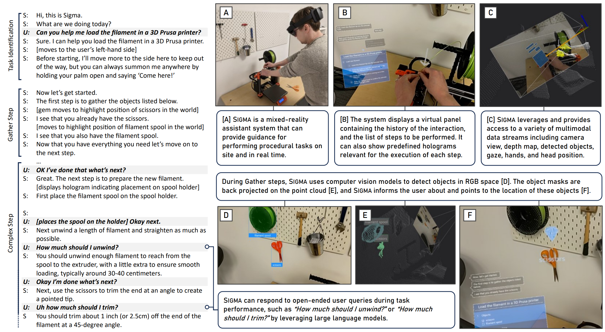

# Situated Interactive Guidance Monitoring and Assistance

## Brief Introduction

Situated Interactive Guidance Monitoring and Assistance (in short SIGMA) is an open-source research prototype system intended to enable research on mixed-reality task assistive agents. The current implementation leverages the sensing and rendering capabilities of the HoloLens 2 headset in conjunction with large language and vision models to guide users step by step through procedural tasks.


*image from "SIGMA: An Open-Source Interactive System for Mixed-Reality Task Assistance Research - Extended Abstract", IEEE VR Abstracts and Workshops, (c) IEEE*

SIGMA is built on top of [Platform for Situated Intelligence](https://github.com/microsoft/psi) and provides several affordances that support and accelerate research and experimentation at the intersection of mixed-reality and AI:

* client-server architecture (sensing and rendering on device, but compute offloaded to a desktop server) enables bypassing existing on-device compute limitations
* modular design allowing for swapping in and out components and models in the context of an end-to-end application
* extensive and performant data logging infrastructure
* data visualization via Platform for Situated Intelligence Studio
* extensible architecture that allows for targeting other devices

We hope SIGMA can accelerate research at the intersection of mixed-reality and AI and help chart a path towards community-driven evaluation of large language, vision, and multimodal models in the context of an end-to-end, real-world, interactive mixed-reality application.

## License

All SIGMA source code (any files under the [Applications](https://github.com/microsoft/psi/tree/master/Applications) folder in this repo) is released under the [Microsoft Research license agreement](https://github.com/microsoft/psi/blob/master/LICENSE-APPLICATIONS.txt).

## Transparency Notes

To enable responsible AI use and development, system transparency notes for SIGMA are available [here](https://github.com/microsoft/psi/wiki/Sigma-Transparency-Note). These transparency notes are intended to help you understand how SIGMA works, what are the system's intended uses, what are its limitations and risks, and the choices researchers can make that influence system performance and behavior. Please read these carefully before using the system in your own research.

## Getting Started

Here are some useful links to get you started:

* [How to install, configure and run SIGMA](https://github.com/microsoft/psi/wiki/Sigma-How-to-Build)
* [How to define tasks](https://github.com/microsoft/psi/wiki/Sigma-How-to-Define-Tasks)
* [How to use and position holograms](https://github.com/microsoft/psi/wiki/Sigma-How-to-Place-Holograms)
* [Data streams captured](https://github.com/microsoft/psi/wiki/Sigma-Data-Streams)

## Technical Report

A description of the SIGMA system is available in the following [arxiv technical report](https://arxiv.org/abs/2405.13035) and in a short [IEEE VR extended abstract](https://ieeexplore.ieee.org/abstract/document/10536320).

If you find the system helpful in your work, please cite both these publications as follows:

```text
@misc{bohus2024sigmaopensourceinteractivemixedreality,
  title={SIGMA: An Open-Source Interactive System for Mixed-Reality Task Assistance Research}, 
  author={Dan Bohus and Sean Andrist and Nick Saw and Ann Paradiso and Ishani Chakraborty and Mahdi Rad},
  year={2024},
  eprint={2405.13035},
  archivePrefix={arXiv},
  primaryClass={cs.HC},
  url={https://arxiv.org/abs/2405.13035}, 
}

@inproceedings{bohus2024sigmaextendedabstract,
  author={Bohus, Dan and Andrist, Sean and Saw, Nick and Paradiso, Ann and Chakraborty, Ishani and Rad, Mahdi},
  booktitle={2024 IEEE Conference on Virtual Reality and 3D User Interfaces Abstracts and Workshops (VRW)}, 
  title={SIGMA: An Open-Source Interactive System for Mixed-Reality Task Assistance Research – Extended Abstract}, 
  year={2024},
  volume={},
  number={},
  pages={889-890},
  keywords={Solid modeling;Three-dimensional displays;Interactive systems;Multimodal sensors;Mixed reality;Virtual reality;User interfaces;mixed-reality;task assistance;artificial intelligence},
  doi={10.1109/VRW62533.2024.00241}
}
```

## Contributing

We are looking forward to engaging with the community to improve and evolve SIGMA! We welcome contributions in many forms: from simply using it, and filing issues and bugs, to creating pull requests for bug fixes or new features. The [Contributing Guidelines](https://github.com/microsoft/psi/wiki/Contributing) page in the wiki describes many ways in which you can get involved, and some useful things to know before contributing to SIGMA and more generally to the \psi codebase.
