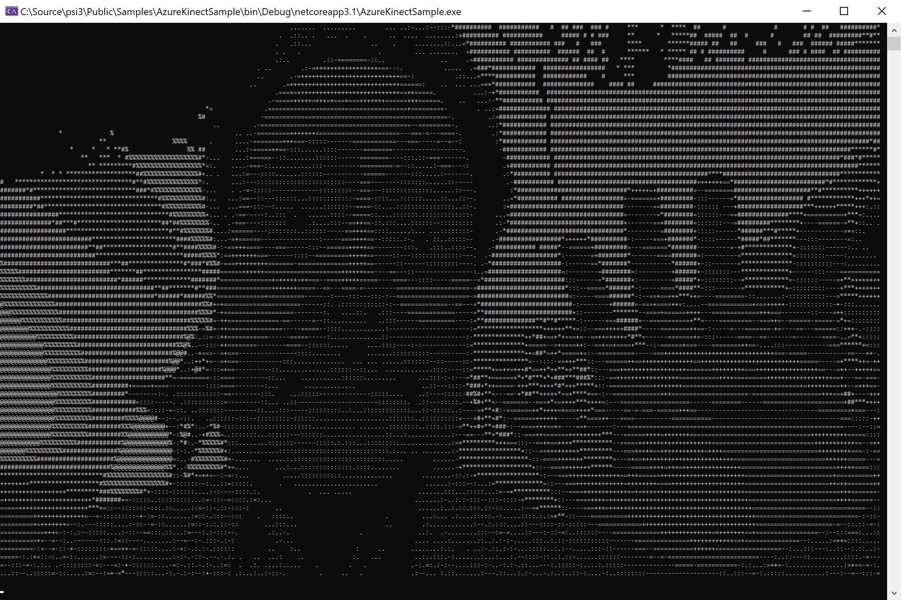

# Azure Kinect Sample

This sample demonstrates how to use the Azure Kinect sensor with body tracking and how to use the `Join()` and `Pair()` operators to synchronize and fuse streams.

# Using the Color Image Stream

First, let's get a minimal application up and running. The `AzureKinectSensor` component gives us access to various image streams from the device (color, depth, infrared) as well as other information such as IMU and temperature readings. We will start with the `ColorImage` stream.

```csharp
using (var pipeline = Pipeline.Create("AzureKinectSample", DeliveryPolicy.LatestMessage))
{
	var azureKinectSensor = new AzureKinectSensor(
		pipeline,
		new AzureKinectSensorConfiguration()
		{
			ColorResolution = ColorResolution.R720p,
			CameraFPS = FPS.FPS15,
		});

    ...
}
```
Notice that at construction time we can configure the frame rate (`CameraFPS`) and resolution (`ColorResolution`). A number of other configuration options are also available as part of the `AzureKinectSensorConfiguration`:

- **DeviceIndex:** The index of the device to open (default 0). 
- **ColorResolution:** The resolution of the color camera (default 1080p).
- **DepthMode:** The depth camera mode (default NFOV unbinned).
- **CameraFPS:** The desired frame rate (default 30 FPS).
- **SynchronizedImagesOnly:** Whether color and depth captures should be strictly synchronized (default `true`).
- **OutputColor:** Whether the color stream is emitted (default `true`).
- **OutputDepth:** Whether the depth stream is emitted (default `true`).
- **OutputInfrared:** Whether the infrared stream is emitted (default `true`).
- **OutputImu:** Whether to use the Azure Kinect's IMU (default `false`).
- **OutputCalibration:** Whether the Azure Kinect outputs its calibration settings (default `true`).
- **BodyTrackerConfiguration:** The body tracker configuration (default null). If null, no body tracking is performed.
- **DeviceCaptureTimeout:** The timeout used for device capture (default 1 minute).
- **FrameRateReportingFrequency:** The frequency at which frame rate is reported on the `FrameRate` emitter (default 2 seconds).
- **Exposure:** Expore of the color sensor (default `0` which is automatic).
- **PowerlineFrequency:** The power adapters frequency (default sixtyHz).
- **WiredSyncMode:** Whether the sensor is operating in standalone mode or sycned (default standalone).
- **DepthDelayOffColor:** The delay between capture of color image and depth image (default `0`).
- **SuboridinateDelayOffMaster:** The delay between the primary sensor capturing a image and the subordinate sensor taking its image.

For this demonstration we'll be resizing the color images to render as ASCII art at the console for a cross-platform solution. The `ColorImage` stream is of `Shared<Image>` on which several operators exist for cropping, transforming, encoding, etc. Below, we use the `Resize()` operator to scale the image down to 80 by 45 pixels, and then we apply a `Do()` operator in which we convert the image to ASCII art:

```csharp
// down sampled resolution
const int widthOutput = 80;
const int heightOutput = 45;

StringBuilder sb = new StringBuilder();

// consuming color
azureKinectSensor.ColorImage.Resize(widthOutput, heightOutput).Do(color =>
{
	var bitmap = color.Resource.ToBitmap();

	// render color frame as "ASCII art"
	sb.Clear();
	for (int y = 0; y < heightOutput; y += 2)
	{
		for (int x = 0; x < widthOutput; x++)
		{
			var p = bitmap.GetPixel(x, y);
			sb.Append(" .:-=+*#%@"[(int)((p.R + p.G + p.B) / 76.5)]);
		}

		sb.Append(Environment.NewLine);
	}

	Console.SetCursorPosition(0, 0);
	Console.WriteLine(sb.ToString());
});

Console.BackgroundColor = ConsoleColor.Black;
Console.ForegroundColor = ConsoleColor.White;
Console.Clear();
pipeline.RunAsync();
Console.ReadLine(); // press Enter to end
```

Here's an example output produced by this application:



# Using the Depth Image Stream

A core feature of the Azure Kinect sensor is depth perception. Next we'll use the `DepthImage` stream to perform background subtraction, i.e. to remove pixels beyond a distance threshold.

```csharp
// background subtraction beyond this depth
const double maxDepth = 1.0; // meters
```

We will _not_ be resizing the depth image but will need to scale coordinates:

```csharp
// camera resolution settings
const ColorResolution resolution = ColorResolution.R720p;
const int widthSource = 1280;
const int heightSource = 720;

// down sampled resolution
const int widthOutput = 80;
const int heightOutput = 45;
const double scaleFactorWidth = (double)widthOutput / widthSource;
const double scaleFactorHeight = (double)heightOutput / heightSource;
```

The `ColorImage` and `DepthImage` streams emit independently. When the component is configured with `SynchronizedImagesOnly = true` (the default) then the images on each stream have matching originating times. However, they remain separate streams and may have varying latencies in the system. In a more complex system they may pass through different paths in the graph of components. We want to ensure that we receive pairs of color and depth images that correspond to the same originating time in the real world regardless of when they arrive in wall clock time at our block of code. To do this we use `Join()`. The operator buffers incoming messages and fuses them in pairs based on their originating times. We'll see later how `Join()` can also be used with a tolerance window to relax the requirement of _exactly_ matching originating times while still guaranteeing reproducibility.

Additionally, we need the `DepthDeviceCalibrationInfo` to correlate the physical poses of the two cameras involved. This comes as a single message on another stream. Here we use `Pair()` to fuse this with the other data we receive; this time _without_ ensuring synchronicity. To learn more about the different types of fusion and synchronization operators available you can [visit this in-depth tutorial.](https://github.com/microsoft/psi/wiki/Synchronization)

The result of the consecutive `Join()` and `Pair()` operators is a stream of tuple `message` which we can unpack with `var (color, depth, calib) = message`. 

```csharp
// consuming color, depth, and calibration
azureKinectSensor.ColorImage
	.Resize(widthOutput, heightOutput)
	.Join(azureKinectSensor.DepthImage)
	.Pair(azureKinectSensor.DepthDeviceCalibrationInfo)
	.Do(message =>
{
	var (color, depth, calib) = message;

	...

	});
```

The `Microsoft.Psi.Calibration` namespace provides a number of useful functions for dealing with depth information via the `DepthExtensions` static class. We'll use `ProjectToCameraSpace()` to get the depth at each color image pixel. Any pixel known to be beyond the `maxDepth` threshold will be rendered blank.

```csharp
var d = DepthExtensions.ProjectToCameraSpace(calib, new Point2D(x / scaleFactorWidth, y / scaleFactorHeight), depth);
if (!d.HasValue || d.Value.Z < maxDepth)
{
	var p = bitmap.GetPixel(x, y);
	sb.Append(" .:-=+*#%@"[(int)((p.R + p.G + p.B) / 76.5)]);
}
else
{
	sb.Append(' '); // subtract background
}
```

# Using the Inertial Measurement Unit (IMU) Stream

The Azure Kinect provides inertial information as well. A gyro gives instantaneous angular speed when the device is physically rotated and an accelerometer gives linear acceleration.

We will assume that the device is relatively stationary and will used accelerometer values to measure the direction of gravity. With this we can rotate the output image to remain upright even as the device is physically turned on its side or upside down; much like mobile phones commonly do.

While `OutputColor` and `OutputDepth` are configured to `true` by default, `OutputIMU` is not. We'll first enable this in the configuration passed in when constructing the sensor.

```csharp
var azureKinectSensor = new AzureKinectSensor(
	pipeline,
	new AzureKinectSensorConfiguration()
	{
		ColorResolution = resolution,
		CameraFPS = FPS.FPS15,
		OutputImu = true,
	});
```

As with the other streams, we will `Join()` with the `Imu` stream. Unlike the color and depth streams, the IMU information flows at a higher rate. It does not obey the `CameraFPS` setting. By default `Join()` correlates messages by _exactly_ matching originating times. This will not work with the IMU because it's on a different cadence. We do want to take samples that are _reasonably_ near to each camera frame. The `Join()` operator allows us to specify what be mean by _reasonably near_; for instance, we can match messages within 10 milliseconds by using `.Join(azureKinectSensor.Imu, TimeSpan.FromMilliseconds(10))`.

```csharp
	// consuming color, depth, IMU, and calibration
	azureKinectSensor.ColorImage.Resize(widthOutput, heightOutput)
		.Join(azureKinectSensor.DepthImage)
		.Join(azureKinectSensor.Imu, TimeSpan.FromMilliseconds(10))
		.Pair(azureKinectSensor.DepthDeviceCalibrationInfo)
		.Do(message =>
	{
		var (color, depth, imu, calib) = message;

		...

	});
```

To determine the orientation we observe the pull of gravity along each axis.

```csharp
// determine camera orientation from IMU
SensorOrientation ImuOrientation(ImuSample imu)
{
	const double halfGravity = 9.8 / 2; // G ≈ 9.8m/s²
	return
		(imu.AccelerometerSample.Z > halfGravity) ? SensorOrientation.Flip180 :
		(imu.AccelerometerSample.Y > halfGravity) ? SensorOrientation.Clockwise90 :
		(imu.AccelerometerSample.Y < -halfGravity) ? SensorOrientation.CounterClockwise90 :
		SensorOrientation.Default; // upright
}
```

We will enumerate pixels in the order required to render upright (from right-to-left, bottom-to-top when the device is upside down for example).

```csharp
// enumerate image coordinates while correcting for orientation
(IEnumerable<int>, IEnumerable<int>, bool) EnumerateCoordinates(SensorOrientation orientation)
{
	var w = Enumerable.Range(0, widthOutput);
	var h = Enumerable.Range(0, heightOutput);
	switch (orientation)
	{
		case SensorOrientation.Clockwise90: return (h.Reverse(), w, true);
		case SensorOrientation.Flip180: return (w.Reverse(), h.Reverse(), false);
		case SensorOrientation.CounterClockwise90: return (h, w.Reverse(), true);
		default: return (w, h, false); // normal
	}
}
```

Changing our nested `for` loops to this order, while swapping `x` and `y` when sideways.

```csharp
var orientation = ImuOrientation(imu);
var (horizontal, vertical, swap) = EnumerateCoordinates(orientation);
foreach (var j in vertical.Where(n => n % 2 == 0))
{
	foreach (var i in horizontal)
	{
		var (x, y) = swap ? (j, i) : (i, j);

        ...
	}

	sb.Append(Environment.NewLine);
}
```

To prevent displaying characters from previous frames we'll keep track of the `lastOrientation` and clear the console when changing between landscape and portrait renderings.

```csharp
SensorOrientation lastOrientation = (SensorOrientation)(-1); // detect orientation changes

...

// clear console when orientation changes
if (orientation != lastOrientation)
{
	Console.Clear();
	lastOrientation = orientation;
}
```

# Body Tracking

Using the depth and infrared image streams, the Azure Kinect may be used to [track one or many human bodies, including detailed joint positions](https://docs.microsoft.com/en-us/azure/kinect-dk/body-joints).

The body tracker can make use of a CUDA supported GPU if one is available (and configured with `CpuOnlyMode = false`). The following other parameters are available as part of the `AzureKinectBodyTrackerConfiguration`:

- **TemporalSmoothing:** The temporal smoothing to use across frames for the body tracker. Set between 0 for no smoothing and 1 for full smoothing (default 0.5 seconds).
- **CpuOnlyMode:** Whether to perform body tracking computation only on the CPU. If false, the tracker requires CUDA hardware and drivers (default `false`).
- **SensorOrientation:** The sensor orientation used by body tracking (default upright).

We configure the Azure Kinect to perform body tracking by providing a body tracker configuration, as follows:

```csharp
var azureKinectSensor = new AzureKinect(
	pipeline,
	new AzureKinectSensorConfiguration()
	{
		OutputImu = true,
		ColorResolution = resolution,
		DepthMode = DepthMode.WFOV_Unbinned,
		CameraFPS = FPS.FPS15,
		BodyTrackerConfiguration = 
			new AzureKinectBodyTrackerConfiguration()
			{
				CpuOnlyMode = true, // false if CUDA supported GPU available
			},
	});
```

Now we can fuse in and make use of the `Bodies` stream.

```csharp
// consuming color, depth, IMU, body tracking, calibration
azureKinectSensor.ColorImage.Resize(widthOutput, heightOutput)
	.Join(azureKinectSensor.DepthImage)
	.Join(azureKinectSensor.Imu, TimeSpan.FromMilliseconds(10))
	.Pair(azureKinectSensor.Bodies)
	.Pair(azureKinectSensor.DepthDeviceCalibrationInfo)
	.Do(message =>
{
	var (color, depth, imu, bodies, calib) = message;

	...

	});
```

Notice that we use `Pair()` to fuse in the `Bodies` stream. The `Bodies` stream generally comes at a lower frequency than the camera image streams. If we were to use a `Join()` here we would have perfectly synchronized data. That is, bodies in sync with color and depth image frames. However the frame rate would drop significantly (especially in `CpuOnlyMode`).

We could use a tolerance `TimeSpan` as we did with the `Imu` stream, but `Join()` has an interesting side effect to consider. Generally before a joined message may be emitted, the _next_ messages outside of the tolerance window must first be seen to ensure that the _best_ match within the window has been chosen. This necessarily introduces some latency. With the high frequency `Imu` stream, this was fine. With the much lower frequency `Bodies` stream this would cause a significant delay. Instead of `Join()` we choose to use `Pair()` which will _immediately_ fuse the last body message (in wall clock time). No latency, but also no synchronicity or reproducibility guarantees. Reproducibility is the primary difference between `Join()` and `Pair()` as explained in more detail in the [synchronization tutorial.](https://github.com/microsoft/psi/wiki/Synchronization)

Finally, we highlight each person's head with a red block; correlating the `Head` joint with the color image pixel coordinate using `ToColorSpace()`.

```csharp
// overlay head tracking
if (orientation == SensorOrientation.Default)
{
	// body tracking works only in initially configured orientation
	Console.BackgroundColor = ConsoleColor.Red;
	foreach (var body in bodies)
	{
		var p = calib.ToColorSpace(body.Joints[JointId.Head].Pose.Origin);
		var x = (int)(p.X * scaleFactorWidth);
		var y = (int)(p.Y * scaleFactorHeight / 2);
		if (x > 0 && x < widthOutput && y > 0 && y < heightOutput)
		{
			Console.SetCursorPosition(x, y / 2);
			Console.Write(' ');
		}
	}

	Console.BackgroundColor = ConsoleColor.Black;
}
```

## Decoupled Body Tracking Component

Body tracking can also be performed without a live, running Azure Kinect sensor, if the depth, IR, and calibration information streams are available. This functionality is implemented by the `AzureKinectBodyTracker` component.

```csharp
var bodyTracker = new AzureKinectBodyTracker(
    pipeline,
    new AzureKinectBodyTrackerConfiguration()
    {
        CpuOnlyMode = true, // false if CUDA supported GPU available
    });
```

This component consumes `DepthImage` and `InfraredImage` streams as well as a the 'AzureKinectSensorCalibration` stream that contains the sensor calibration information; these streams are produced by the `AzureKinectSensor` component, and can be persisted and leveraged for running the tracker at a later time.

For instace, assuming these streams were persisted into a store, we can open them up as follows: 

```csharp
var store = PsiStore.Open(pipeline, "MyRecording", @"C:\Data");
var depth = store.OpenStream<Shared<DepthImage>>("DepthImage"); // DepthImage
var infrared = store.OpenStream<Shared<Image>>("InfraredStream"); // ColorImage
var calibration = store.OpenStream<Calibration>("AzureKinectSensorCalibration"); // AzureKinectSensorCalibration
```

The depth and infrared streams are joined and piped to the body tracker. The calibration stream is also separately piped to the body tracker. The tracker generates the resulting bodies on it's `Bodies` output stream.

```csharp
depth.Join(infrared).PipeTo(bodyTracker);
calibration.PipeTo(bodyTracker.AzureKinectSensorCalibration);

var bodies = bodyTracker.Bodies;
```

## A Note About Coordinate Systems

The `AzureKinectBodyTracker` and `AzureKinectSensor` components emit all calibration, joint, and body orientation information in the coordinate system basis of MathNet.Spatial. This is a different basis assumption from that used by the sensor technology underneath for [joints](https://docs.microsoft.com/en-us/azure/Kinect-dk/body-joints) and for the [sensor itself](https://docs.microsoft.com/en-us/azure/Kinect-dk/coordinate-systems).

All coordinate systems are immediately rebased inside the component such that the X-axis represents "forward", the Y-axis represents "left", and Z-axis represents "up". All coordinate system information emitted by these components adhere to this basis.

        	Z
        	|   X
        	|  /
        	| /
 	 Y <----+