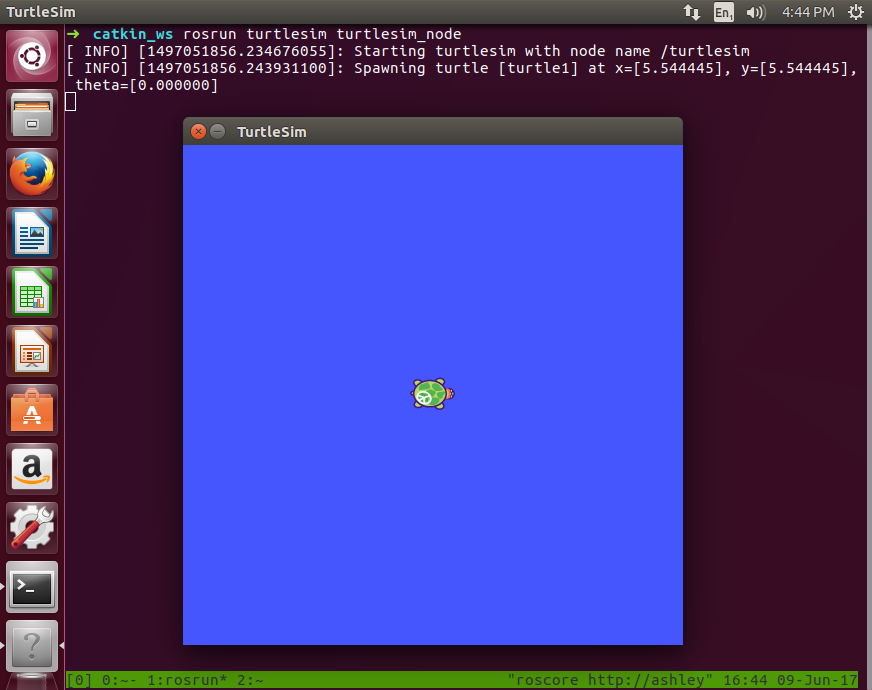
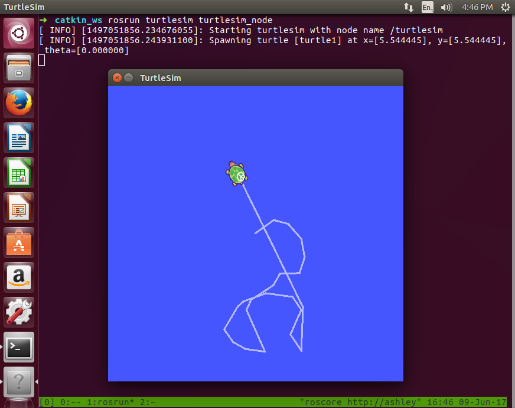

# ROS Turtle Sample

In this sample, we'll create a simple console app to control the ROS TurtleSim.
The sample itself will run under the Core CLR (Mac/Linux/Windows), but depends on ROS running under Linux.
An overview of ROS and our ROS bridge is [covered in a separate document](https://github.com/microsoft/psi/wiki/ROS-Integration).

First we will build a simple class to talk to the Turtle sim, then we'll expose this as a \psi component and will write a small app making use of it.

## ROS World

Assuming you've [installed ROS](http://wiki.ros.org/lunar/Installation/Ubuntu) on a Linux VM, let's spin up the `turtlesim`:

```Shell
# roscore &
# rosrun turtlesim turtlesim_node
```



Listing topics, we notice:

```Shell
# rostopic list

/turtle1/cmd_vel
/turtle1/pose
```

The `cmd_vel` takes a `geometry_msgs/Twist`, giving a pair of full 3D vectors to drive the turtle:

```Shell
# rostopic info /turtle1/cmd_vel

Type: geometry_msgs/Twist

# rosmsg info geometry_msgs/Twist

geometry_msgs/Vector3 linear
    float64 x
    float64 y
    float64 z
geometry_msgs/Vector3 angular
    float64 x
    float64 y
    float64 z
```

The `pose` produces a stream of `turtlesim/Pose` (a non-standard type), reporting the position/orientation and velocities:

```Shell
# rosmsg info turtlesim/Pose

float32 x
float32 y
float32 theta
float32 linear_velocity_
float32 angular_velocity_
```

Since this is not a standard message type, we will need to define it ourselves in a moment. We'll need the MD5 hash for this:

```Shell
# rosmsg md5 turtlesim/Pose

863b248d5016ca62ea2e895ae5265cf9
```

## \psi World

First, we'll create a console app and reference the `Microsoft.Psi` and `Microsoft.Ros` NuGet packages.
The idea will be to create a class to communicate with the TurtleSim through ROS and expose a _classic_ interface.
Then we'll create a \psi wrapper to expose a stream-oriented interface.
Separating the logic from the \psi wrapper is a good idea.

```C#
class Turtle
{
    private const string NodeName = "/turtle_sample";
    private RosNode.Node node;

    private const string CmdVelTopic = "/turtle1/cmd_vel";
    private RosPublisher.IPublisher cmdVelPublisher;

    private const string PoseTopic = "/turtle1/pose";
    private RosSubscriber.ISubscriber poseSubscriber;

    private readonly string rosSlave;
    private readonly string rosMaster;

    public Turtle(string rosSlave, string rosMaster)
    {
        this.rosSlave = rosSlave;
        this.rosMaster = rosMaster;
    }

    public void Connect()
    {
        this.node = new RosNode.Node(NodeName, this.rosSlave, this.rosMaster);
        this.cmdVelPublisher = node.CreatePublisher(RosMessageTypes.Geometry.Twist.Def, CmdVelTopic, false);
        this.poseSubscriber = node.Subscribe(this.PoseMessageDef, PoseTopic, PoseUpdate);
    }

    public void Disconnect()
    {
        this.node.UnregisterPublisher(CmdVelTopic);
        this.node.UnregisterSubscriber(PoseTopic);
    }
}
```

The `RosNode.Node` represents our class as a "node" in the ROS world. It has a name and maintains bookkeeping of the set of publishers and subscribers.
Notice that we can `CreatePublisher(...)` from a standard `Geometry.Twist` message definition already available in the library.
However, to `Subscribe(...)` to the `PoseTopic` we need to provide our own `PoseMessageDef`:

```C#
private RosMessage.MessageDef PoseMessageDef = RosMessage.CreateMessageDef(
    "turtlesim/Pose",
    "863b248d5016ca62ea2e895ae5265cf9",
    new[] {
        Tuple.Create("x", RosMessage.RosFieldDef.Float32Def),
        Tuple.Create("y", RosMessage.RosFieldDef.Float32Def),
        Tuple.Create("theta", RosMessage.RosFieldDef.Float32Def),
        Tuple.Create("linear_velocity", RosMessage.RosFieldDef.Float32Def),
        Tuple.Create("angular_velocity", RosMessage.RosFieldDef.Float32Def)
    });
```

A message definition consists of a topic name, the MD5 hash, and a sequence of name/`RosFieldDef` pairs.

The _normal_ .NET mechanism to represent a subscription is an `Event`:

```C#
public event EventHandler<(float, float, float)> PoseChanged;

private void PoseUpdate(IEnumerable<Tuple<string, RosMessage.RosFieldVal>> position)
{
    if (this.PoseChanged != null)
    {
        dynamic pos = RosMessage.GetDynamicFieldVals(position);
        this.PoseChanged(this, (pos.x, pos.y, pos.theta));
    }
}
```

Incoming ROS messages (given to `PoseUpdate(...)`) are sequences of name/`RosFieldVal` (note, not `RosFieldDef`), and may themselves be composite structures forming trees..
We may parse this however we like. There are static helper functions in `RosMessage` to convert individual values
(e.g. `GetInt32Val(...)`, `GetFixedArrayVal(...)`, `GetStructVal(...)`, ...) as well as a function to convert
to `dynamic` (`GetDynamicVal(...)`).
Notice that we choose not to surface the velocities (`linear_velocity`, `angular_velocity`).

Outgoing ROS messages are also sequences of name/`RosFieldVal` and we're responsible for constructing the tree.
In the case of velocity commands, they are composed of existing standard types, so we can use `ToMessage(...)` and other available helpers.
Really, our turtle is merely 2D and so we only care about `linear.x` for forward/backward translation and `angular.z` for rotation.
We don't surface the others in the interface and simply fill them in with zeros in the message:

```C#
public void Velocity(float linear, float angular)
{
    this.cmdVelPublisher.Publish(
        RosMessageTypes.Geometry.Twist.ToMessage(
            new RosMessageTypes.Geometry.Twist.Kind(
                new RosMessageTypes.Geometry.Vector3.Kind(linear, 0, 0),
                new RosMessageTypes.Geometry.Vector3.Kind(0, 0, angular))));
}
```

We could call it done at this point. We have a working class with an imperative style interface, but \psi is such a nice environment in which to build these systems (especially once we move far beyond "hello world")
We'll now construct a simple wrapper to join the \psi world.

```C#
public class TurtleComponent : ISourceComponent
{
    private readonly Pipeline pipeline;
    private readonly Turtle turtle;

    private Action<DateTime> notifyCompletionTime;
    private bool stopped;

    public TurtleComponent(Pipeline pipeline, Turtle turtle)
    {
        this.pipeline = pipeline;
        this.turtle = turtle;
        this.Velocity = pipeline.CreateReceiver<(float, float)>(this, (c, _) => this.turtle.Velocity(c.Item1, c.Item2), nameof(this.Velocity));
        this.PoseChanged = pipeline.CreateEmitter<(float, float, float)>(this, nameof(this.PoseChanged));
    }

    public Receiver<(float, float)> Velocity { get; private set; }

    public Emitter<(float, float, float)> PoseChanged { get; private set; }

    public void Start(Action<DateTime> notifyCompletionTime)
    {
        this.notifyCompletionTime = notifyCompletionTime;
        this.turtle.Connect();
        this.turtle.PoseChanged += this.OnPoseChanged;
    }

    public void Stop()
    {
        this.stopped = true;
        this.turtle.Disconnect();
        this.turtle.PoseChanged -= this.OnPoseChanged;
        this.notifyCompletionTime(this.pipeline.GetCurrentTime());
    }

    private void OnPoseChanged(object sender, (float, float, float) pose)
    {
        if (!this.stopped)
        {
            this.PoseChanged.Post(pose, this.pipeline.GetCurrentTime());
        }
    }
}
```

The `PoseChanged` `Event` becomes an `Emitter` and the `Velocity(...)` method becomes a `Receiver`.
We make our component `ISourceComponent` and `Connect()`/`Disconnect()` the `turtle` as well as register/unregister the event handler upon pipeline start/stop.
The component is not allowed to post messages when the pipeline is not running (i.e. before `OnPipelineStart` or after `OnPipelineStop`).
To this end, we maintain the `stopped` flag and guard within `OnPoseChanged`.

Finally, to make use of our component, we make a very straightforward app to spew pose updates to the console and to map key events to motion.

```C#
class Program
{
    private const string rosSlave = "127.0.0.1";
    private const string rosMaster = "127.0.0.1";

    static void Main(string[] args)
    {
        using (var pipeline = Pipeline.Create())
        {
            var turtle = new TurtleComponent(pipeline, new Turtle(rosSlave, rosMaster));
            turtle.PoseChanged.Do(p => Console.WriteLine($"x={p.Item1} y={p.Item2} theta={p.Item3}"));
            var keys = Generators.Sequence(pipeline, Keys(), TimeSpan.FromMilliseconds(10));
            keys.Select(k =>
            {
                if (k == ConsoleKey.Q)
                {
                    turtle.Stop();
                }

                var linear  = k == ConsoleKey.UpArrow   ? 1f : k == ConsoleKey.DownArrow  ? -1f : 0f;
                var angular = k == ConsoleKey.LeftArrow ? 1f : k == ConsoleKey.RightArrow ? -1f : 0f;
                return (linear, angular);
            }).Subscribe(turtle.Velocity);
            pipeline.Run();
        }
    }

    static IEnumerable<ConsoleKey> Keys()
    {
        while (true)
        {
            var key = Console.ReadKey(true).Key;
            yield return key;

            if (key == ConsoleKey.Q)
            {
                yield break;
            }
        }
    }
}
```

Console keys are surfaced as an `IEnumerable` terminated when 'Q' is pressed.
Similarly, the `turtle` component is stopped upon pressing 'Q'.
With no components running the pipeline shuts down.

Be sure to update the `rosSlave` (dev machine) and `rosMaster` (ROS machine) IP addresses as needed.
Use the actual IP address of the dev machine, because commands will not work if left as 127.0.0.1.
Also, in the less common case that you run a distributed ROS system in which nodes are running on machines other than the ROS master, then you need to add hostname/IP mappings for these (e.g. `RosDns.add("my-hostname", "10.1.2.3")`).



## Links

* A [tutorial using physical robot arm hardware](https://github.com/Microsoft/psi/blob/master/Samples/RosArmControlSample)
* An [overview of ROS and our ROS bridge](https://github.com/microsoft/psi/wiki/ROS-Integration)
